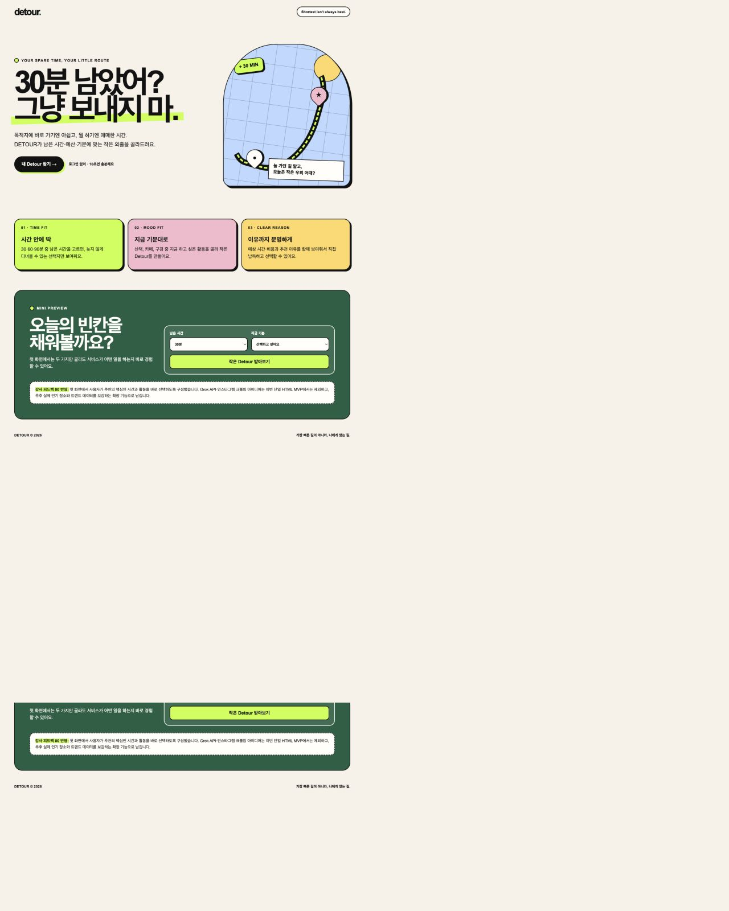

# DETOUR

**남는 시간을 나만의 우회로로.**

DETOUR는 갑자기 생긴 여유 시간과 현재 위치, 예산, 하고 싶은 활동을 바탕으로 지금 바로 갈 만한 장소와 코스를 추천해주는 반응형 웹 서비스입니다.



## 어떤 앱/웹을 만드는가

DETOUR는 사용자가 다음과 같은 상황에서 빠르게 선택할 수 있도록 돕습니다.

> “서울에서 약속이 취소돼서 2시간이 남았어. 2만 원 안에서 조용히 쉬고 싶어.”

사용자는 목적지, 남은 시간, 예산, 원하는 활동을 입력합니다. DETOUR는 장소 데이터와 추천 점수를 이용해 조건에 맞는 장소 TOP 3와 추천 이유, 이동 정보를 보여줍니다.

최종 목표는 다음 흐름이 실제로 동작하는 서비스입니다.

```text
사용자 입력 → FastAPI → 장소 데이터 → 추천 점수 계산 → TOP 3 → 지도 표시
```

## 누구에게 필요한가

- 갑자기 일정이 비어 짧은 시간을 알차게 보내고 싶은 사람
- 선택지가 너무 많아 어디로 갈지 결정하기 어려운 사람
- 시간과 예산을 함께 고려한 현실적인 추천이 필요한 사람
- 관광지만 나열하는 검색보다 “지금 내 상황에 맞는 선택”을 원하는 사람

## 왜 만들게 되었는가

기존 장소 검색 서비스는 장소를 많이 보여주지만, 사용자의 남은 시간·예산·기분을 함께 고려해 바로 실행할 수 있는 선택지를 만들어주는 데에는 한계가 있습니다.

DETOUR는 “갈 곳이 없다”가 아니라 “선택하기 어렵다”는 문제에서 출발했습니다. 복잡한 추천 결과 대신, 현재 조건에서 왜 이 장소가 어울리는지 설명하는 작고 명확한 추천을 만드는 것이 목표입니다.

## 5주 동안 만드는 것

5주 동안 학습과 구현을 함께 진행하며, 실제 배포 가능한 MVP를 완성합니다.

| 주차 | 제품 구현 | 함께 공부할 기술 |
| --- | --- | --- |
| 1주 | `index.html` 입력 화면과 예시 결과 카드 | HTML, CSS, JavaScript, CDN, DOM Event |
| 2주 | Frontend와 FastAPI 연결 | HTTP, REST API, JSON, Pydantic, `fetch()` |
| 3주 | 장소 데이터 저장·정제·조회 | CSV/JSON, DB 기초, pandas, feature |
| 4주 | 추천 시스템·TOP 3·서비스 통합 | normalization, weight, ranking |
| 5주 | 지도·모바일 UX·배포·운영·테스트 | 지도 API, geolocation, HTTPS, production |

## 현재 구성

- `detour-landing.html` — 현재 랜딩 페이지 시안
- `index.html` — Week 1 수업 제출용 정적 프로토타입
- `frontend/` — 보관 중인 Next.js 실험 프로토타입(이번 주 제출 범위 아님)
- `DETOUR_PROJECT_SPEC.md` — 제품 및 기술 명세
- `DETOUR_5WEEK_HANDOFF.md` — 5주 구현 계획과 인수인계 문서
- [`PLAN.md`](./PLAN.md) — 5주 주간·일간 실행 계획
- [`study/`](./study) — 주차별 학습 기록
- [`journal/`](./journal) — 날짜별 고민·결정·회고 기록
- [`docs/PROJECT_CONTEXT.md`](./docs/PROJECT_CONTEXT.md) — 새 세션·협업자를 위한 프로젝트 빠른 시작 안내
- [`docs/MVP_DECISION_RULES.md`](./docs/MVP_DECISION_RULES.md) — 5주 MVP의 고정 범위와 기능 추가 기준
- `docs/landing-preview.png` — README용 화면 미리보기

## 실행하기

현재는 별도 빌드 도구 없이 정적 HTML로 시작합니다.

```bash
open detour-landing.html
```

이번 주에는 빌드 도구 없이 `index.html` 한 파일로 화면을 완성합니다. 실제 AI와 API는 다음 주에 연결합니다. [수업 기준 Week 1 브리프](./docs/COURSE_WEEK1_BRIEF.md)를 참고하세요.

## 학습 기록

코드를 만들면서 배운 개념은 [`study/README.md`](./study/README.md)에 주차별로 기록합니다. 각 학습 기록에는 개념 설명, DETOUR 적용 위치, 실제 코드, 실습 결과를 함께 남깁니다.

## 프로젝트 상태

현재 GitHub `main` 브랜치에 초기 랜딩 페이지와 프로젝트 문서가 올라가 있습니다. 이후 매주 하나의 작동하는 기능을 추가하고, 구현 과정은 GitHub 커밋과 학습 기록으로 남깁니다.

Repository: [nocked115/DeTour](https://github.com/nocked115/DeTour)
